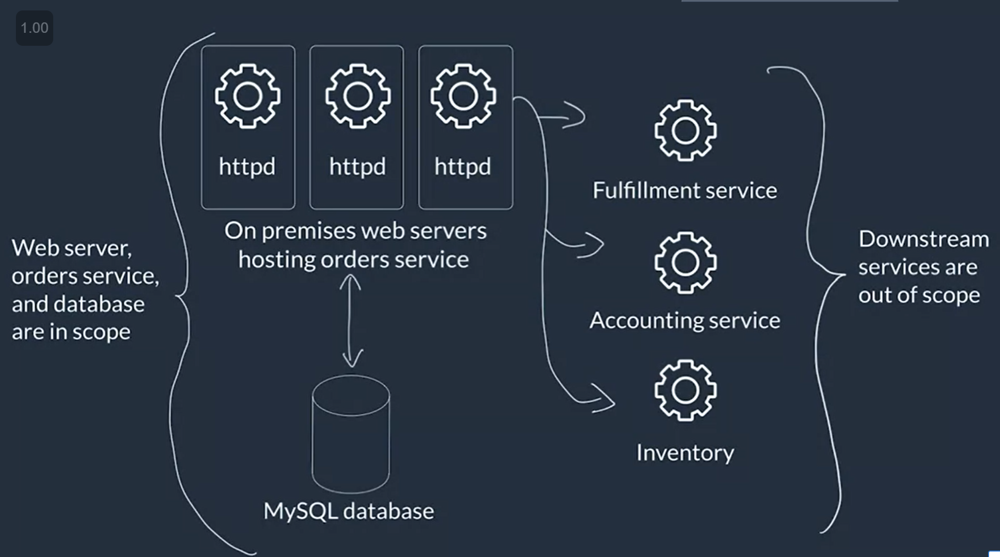

BEFORE

* Lift and Shift Model
* Ecommerce App [Typical setup: ]
* Deployed ON-PREMISE
* (order service) --> validates, authenticates, orders, processes, stores the orders in DB
* (accounting service) -->
* (inventory servicce)
* spiky demands (voucher, flash sales)
* need monitoring and logging
* optimise cost and performance

  

  REQUIREMENTS:
* have managed scaling
* decouple solution components to maximize resilience
* have centralized monitoring and logging
* optimize for cost, performance efficiency and operational overhead
*
